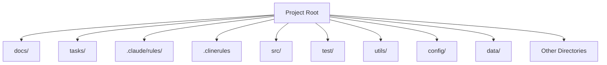

# Standard project directory structure.

## 🗺️ Directory Structure

*   **Memory Files:** Specific documentation files are maintained within `docs/` and `tasks/` (See `documentation-memory.md`).
*   **Rules:** AI guidance rules are kept in `.claude/rules/`.
*   **Fixes:** Document complex bug fixes in `fixes/`.
