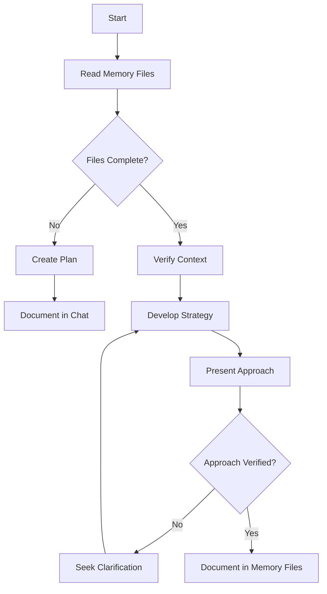

# Workflow for planning and architecture tasks (PLAN/Architect MODE).

## 📝 Planning Workflow (PLAN/Architect MODE)

*   **MODE Selection:** Determine if the current request implies PLAN/Architect MODE or ACT/Code MODE. If unsure, ask for clarification. User can explicitly set `MODE = PLAN MODE`.

**1. Understand Requirements:**
    *   **<CLARIFICATION>**
        *   Ask for clarifications and follow-ups. Identify and detail underspecified requirements.
        *   Fully understand the problem, goals, assumptions, and remove ambiguities.
        *   Anticipate needs and suggest alternative solutions.
        *   Proceed only with 100% clarity and confidence.
    *   **Review Documentation:** *Before* starting, thoroughly review relevant project docs:
        *   `docs/product_requirement_docs.md` (PRD)
        *   `README.md` (Overview, setup, tech stack)
        *   `docs/architecture.md` (System architecture)
        *   `docs/technical.md` (Technical specs, patterns)
        *   `tasks/tasks_plan.md` (Task details)
        *   If docs are missing, unclear, or conflicting, **ask for clarification**.
    *   **Architecture Adherence:**
        *   Understand and respect module boundaries, data flow, interfaces, and dependencies from `docs/architecture.md`.
        *   Validate that proposed changes comply with the architecture. Warn and propose compliant solutions if violations are detected. (See `architecture-understanding.md`)
    *   **Use Existing Patterns:** Reference `README.md` and `docs/technical.md` to understand and use existing patterns/technologies. Exhaust options with existing implementations before proposing new ones.

**2. Formulate Solution:**
    *   **<STEP BY STEP REASONING>**
        *   **<DECOMPOSE>** Have a meta-architecture plan. Break the problem into smaller sub-problems/concepts.
        *   Ultrathink of all possible solutions.
        *   Emphasis on simplicity and speed of the application
        *   Create checks which will intercepts problems with an applicaiton before application is serving pages
        *   Define evaluation criteria and trade-offs.
        *   Find the optimal solution, explain why it's optimal and its trade-offs.
        *   **<WEB USE>** Use web search (e.g., Perplexity) if needed for research.
        *   **<MULTI ATTEMPTS>** Rigorously question assumptions and inferences. Think of better solutions by combining the best aspects of others. Repeat until a strong solution is found.

**3. Solution Validation:**
    *   **<REASONING PRESENTATION>**
        *   Provide the PLAN in detail, step-by-step.
        *   Reason its optimality compared to alternatives.
        *   State all assumptions, choices, decisions, and trade-offs.
        *   Restate the user's query if needed for clarity.
        *   When creating a project, ask Claude Code to include software stack versions and compatible module versions 
        *   Records software stack, versions and module dependencies and their versions
        *   Document the entire database schema in docs/planning/[project-name]-planning.md.
        *   After adding a major feature or completing a milestone, update docs/tasks/[project-name]-milestones.md.
    *   **Validate Plan:** Before implementing, validate the solution plan. 

** 4. System Patterns:**
    *  **Structured Approach:**
        * Documents the system architecture
        * Records key technical decisions
        * Lists design patterns in use
        * Records current features
        * Documents the evolution of project decisions 
        * Notes technical constraints
        * Explains component relationships
        * Lists known issues and limitations
        * Describes development setup
        * Lists technologies and frameworks used
        * Records current status of features
        * Tracks what works and what's left to build
Example: "User authentication complete; inventory management 80% complete; reporting not started"
Example: "Using Redux for state management with a normalized store structure"

** 5. Dependencies Documentation:**
        * Identify modules or dependency module names and versions
	* Using context7 pull documentation for these modules and dependencies
        * Update implementation commands based on up-to-date documentation pulled using context7
