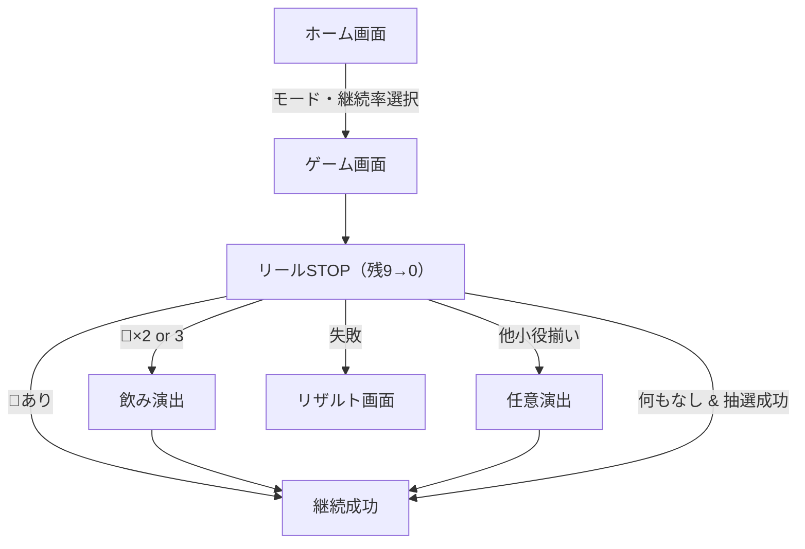

もちろんです。以下に、\*\*最新の仕様を完全に統合した要件定義書（v3.0）\*\*をお届けします。

---

# 🎰 スロットゲーム 要件定義書（v3.0・2025年8月）

---

## 0. 🎯 概要

本ゲームは3リール式スロットゲームであり、「継続演出」を中心に、当たり契機・小役演出・飲み🍺エフェクトなどの要素を通じてシンプルかつ中毒性のあるプレイ体験を提供する。
将来的に複数モードに対応可能な設計とする。

---

## 1. 🏠 ホーム画面

### 1.1 表示内容

* ゲームタイトル
* モード選択（例：継続モード ※将来追加）
* 継続率選択（70%、80%、90%、100%）
* 「ゲーム開始」ボタン

---

## 2. 🎮 ゲームルール（継続モード）

### 2.1 構成

| 項目    | 内容                                    |
| ----- | ------------------------------------- |
| リール数  | 3                                     |
| 回転回数  | 3スピン（合計9回のSTOP操作）                     |
| 操作    | 各リールに「STOP」ボタンを表示、順不同で止められる           |
| 表示    | 残りストップ数（9→8→…→0）をリアルタイム表示             |
| 継続成功時 | `continueCount += 1`し、9回にリセットして次ラウンドへ |
| 継続失敗時 | リザルト画面に移行し、継続回数を表示                    |

---

## 3. 🎲 絵柄と出現率

### 3.1 シンボル構成（出現率を制御）

| シンボル | 意味       | 出現率（個別リール） |
| ---- | -------- | ---------- |
| 🍒   | 当たり契機    | 5%         |
| 🍋   | 小役（継続対象） | 約23.75%    |
| 🍇   | 小役       | 約23.75%    |
| 💎   | 小役       | 約23.75%    |
| 🔔   | 小役       | 約23.75%    |

> 絵柄出現は**重み付き配列**などで制御し、🍒が出過ぎないようにする

---

## 4. ✅ 継続判定のロジック（占有率に基づく）

### 4.1 成立条件と継続扱い

| 成立内容                | 継続  | 飲み演出       | 説明                        |
| ------------------- | --- | ---------- | ------------------------- |
| 🍒が1つ以上             | ✅   | なし         | リール内に1つでも含まれていれば継続        |
| 🍒が2つ               | ✅   | 🍺×2       |                           |
| 🍒が3つ揃い             | ✅   | 🍺×3       | 特殊演出あり                    |
| 🍒以外の小役揃い（例：🔔🔔🔔） | ✅   | 任意（例：🍺×1） | 占有率を50%に制限                |
| 上記いずれもなし            | ❌抽選 | なし         | `Math.random() < 継続率` による |

---

### 4.2 継続成功の**占有率構成（制御対象）**

| 成立要因    | 継続占有率（全体のうち） |
| ------- | ------------ |
| 🍒出現    | 10%（1つ以上含む）  |
| 他小役3つ揃い | 50%          |
| 継続率抽選   | 40%          |

> ※ 各継続判定が重複しないよう、優先順位をつけて処理

---

## 5. 🍺 飲み演出（ボーナス）

### 5.1 トリガーと内容

| トリガー条件 | 表示内容          | 処理            |
| ------ | ------------- | ------------- |
| 🍒×2   | 🍺🍺 モーダル表示   | ボタン押下で継続処理へ   |
| 🍒×3   | 🍺🍺🍺 モーダル表示 | 自動または手動で閉じて継続 |
| 他小役揃い  | 任意（例：🍺×1）    | 任意の演出処理を実装可   |

---

## 6. 🧠 ロジック設計指針（実装向け）

### 6.1 スピン制御ロジック（当たり占有率に応じて生成）

```ts
const roll = Math.random();
if (roll < 0.10) {
  result = assignWithCherry();
} else if (roll < 0.10 + 0.50) {
  result = assignWithSmallYaku();
} else {
  result = assignRandomSymbols();
}
```

---

### 6.2 継続判定ロジック（出現結果に応じて）

```ts
if (result.includes("🍒")) {
  const count = result.filter(s => s === "🍒").length;
  if (count === 3) showDrinkBonus(3);
  else if (count === 2) showDrinkBonus(2);
  continueCount++;
  resetRound();
} else if (isSmallYakuMatch(result)) {
  continueCount++;
  showDrinkBonus(1); // optional
  resetRound();
} else if (Math.random() < continueRate) {
  continueCount++;
  resetRound();
} else {
  showResult();
}
```

---

## 7. 📺 画面遷移と構成



---

## 8. 💡 拡張の余地

| 項目         | 拡張可能性              |
| ---------- | ------------------ |
| ゲームモード追加   | チャレンジモード・連チャンモードなど |
| 音声演出       | スピン音・当たりSE・飲みSE    |
| リールアニメーション | CSS/Canvasによる本格演出  |
| スコア記録      | LocalStorage対応     |
| シンボル追加     | スイカ・BARなどによる役構成の追加 |

---
